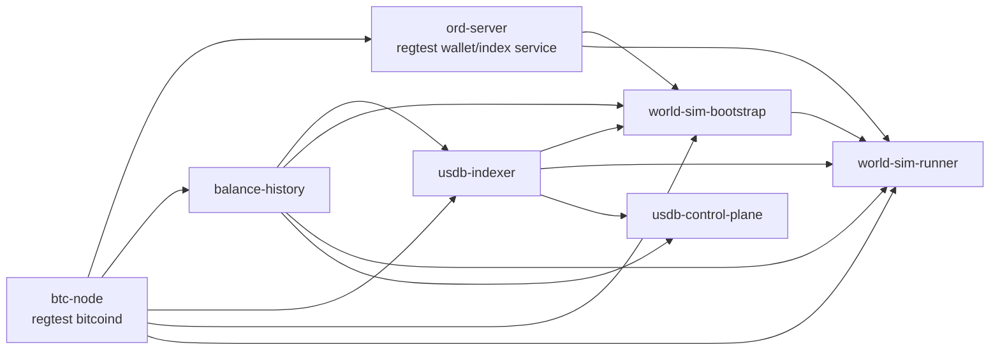

# Dev-Sim World-Sim Plan

## 1. Goal

This document defines how to integrate the existing regtest `world-sim`
infrastructure into the Docker-based `dev-sim` environment without changing the
default local development path.

The target is:

- keep `dev-sim` as the default baseline stack
- add `world-sim` as an optional overlay
- reuse the existing agent simulation model instead of re-implementing it
- make the local control console show a network that is actively producing BTC
  blocks and protocol activity

## 2. Design Principles

### 2.1 Keep default `dev-sim` unchanged

The current `dev-sim` remains the standard local stack:

- `bitcoind` in `regtest`
- `balance-history`
- `usdb-indexer`
- `ethw-node`
- `usdb-control-plane`

This stack should still be usable without background protocol traffic.

### 2.2 Add `world-sim` as an overlay

The simulation layer should be introduced through:

- `docker/compose.world-sim.yml`

This overlay adds extra services, but does not alter the meaning of the base
`dev-sim` stack.

### 2.3 Reuse the existing simulation logic

The canonical protocol simulation logic already exists in:

- [regtest_world_simulator.py](/home/bucky/work/usdb/src/btc/usdb-indexer/scripts/regtest_world_simulator.py)
- [regtest_world_sim.sh](/home/bucky/work/usdb/src/btc/usdb-indexer/scripts/regtest_world_sim.sh)
- [run_live.sh](/home/bucky/work/usdb/src/btc/usdb-indexer/scripts/run_live.sh)

The Docker integration should reuse these semantics and defaults instead of
creating a second simulation model.

### 2.4 Separate bootstrap from steady-state simulation

The Docker runtime should explicitly distinguish between:

- one-shot bootstrap
- steady-state simulation loop

This avoids repeatedly funding agent wallets every time the simulator container
restarts and makes persistent-state behavior easier to reason about.

## 3. First-Batch Scope

The first implementation batch should add:

1. an `ord-server` service for regtest wallet and inscription operations
2. a `world-sim-bootstrap` one-shot service that:
   - waits for `btc-node`, `ord-server`, `balance-history`, and `usdb-indexer`
   - prepares miner and agent wallets
   - performs the same premine / funding / confirmation flow as the existing
     standalone world-sim scripts
   - writes a bootstrap marker into persistent world-sim state
3. a `world-sim-runner` service that:
   - requires the bootstrap marker
   - runs the simulator without redoing wallet funding
4. a helper command for local operators

The first batch does **not** need to:

- replace the current standalone shell world-sim entrypoints
- make `world-sim` part of the default `dev-sim` boot path
- automatically wire ETHW user wallets
- add a production deployment path

## 4. Service Topology

## 5. Image and Binary Strategy

The runtime model now uses dedicated packaged images for the optional overlay:

- `usdb-bitcoin28-regtest`
- `usdb-world-sim-tools`

These images are still built from the already validated local binaries:

- Bitcoin Core 28.x host binaries
- the locally built `ord` binary

The rationale is:

- runtime no longer depends on host-mounted binaries
- local tests and future release bundles use the same image contract
- the packaging step still stays small and reuses known-good local artifacts

The detailed packaging plan is documented in:

- [world-sim-release-image-plan.md](/home/bucky/work/usdb/doc/world-sim-release-image-plan.md)

## 6. Configuration Model

The world-sim overlay uses a dedicated env file, separate from the default
`dev-sim` env:

- `docker/env/world-sim.env.example`
- local copy:
  - `docker/local/world-sim/env/world-sim.env`

This keeps the default `dev-sim` path unchanged while still allowing a single
command to start the optional overlay.

The recommended default is to give `world-sim` its own Docker network name, so
it does not share service aliases like `btc-node` or `ord-server` with other
local stacks that may already be running.

Key runtime inputs:

- image tags for:
  - `WORLD_SIM_BITCOIN_IMAGE`
  - `WORLD_SIM_TOOLS_IMAGE`
- dedicated overlay network:
  - `USDB_DOCKER_NETWORK`
- world-state policy:
  - `WORLD_SIM_STATE_MODE`
  - `WORLD_SIM_IDENTITY_SEED`
- simulation parameters such as:
  - `SIM_BLOCKS`
  - `SIM_LOOP_BATCH_BLOCKS`
  - `SIM_SEED`
  - `AGENT_COUNT`
  - `SIM_SLEEP_MS_BETWEEN_BLOCKS`

The runtime and determinism boundary is documented in:

- [world-sim-deterministic-state-plan.md](/home/bucky/work/usdb/doc/world-sim-deterministic-state-plan.md)

## 7. Operator Entry

The recommended local entry is a helper script:

- `docker/scripts/run_world_sim.sh`

This helper should:

- initialize `docker/local/world-sim/env/world-sim.env` from the example if
  missing
- expose a dedicated `build-images` action for packaging the release-style
  world-sim images from the local binaries
- keep `world-sim` separate from plain `dev-sim`
- provide a stable operator interface:
  - `up`
  - `up-full`
  - `build-images`
  - `ps`
  - `logs`
  - `down`

Recommended behavior:

- `up`
  - starts the BTC-side stack plus world-sim bootstrap and simulation
  - does not require `ethw-node`
- `up-full`
  - starts the same stack and keeps the normal `ethw-node` in the graph
- `down`
  - stops containers but keeps world state
- `reset`
  - stops containers and removes volumes

Current state-policy semantics:

- `WORLD_SIM_STATE_MODE=persistent`
  - keep volumes and resume the current world
- `WORLD_SIM_STATE_MODE=reset`
  - clear volumes before startup
- `WORLD_SIM_STATE_MODE=seeded-reset`
  - clear volumes before startup
  - require `WORLD_SIM_IDENTITY_SEED`
  - deterministically recreate miner and agent ord wallet identities from that seed
  - record the chosen identity seed and identity scheme in bootstrap metadata

## 8. Expected Console Outcome

Once the world-sim runner starts producing blocks and protocol actions, the
control console should move from mostly static readiness indicators to a live
system view:

- BTC height increasing
- `balance-history` and `usdb-indexer` synced heights increasing
- protocol-related data becoming queryable

This provides a much better local demo and later becomes a stronger base for:

- wallet integration
- miner-pass mint demos
- SourceDAO contract interaction demos

## 9. Future Extensions

After the first batch is stable, the next candidates are:

1. expose world-sim report artifacts in the console
2. add an `interactive sandbox` mode for manual user actions without random
   background traffic
3. exact mid-batch deterministic replay and crash recovery
4. later connect ETH / BTC wallet flows to the same local stack
