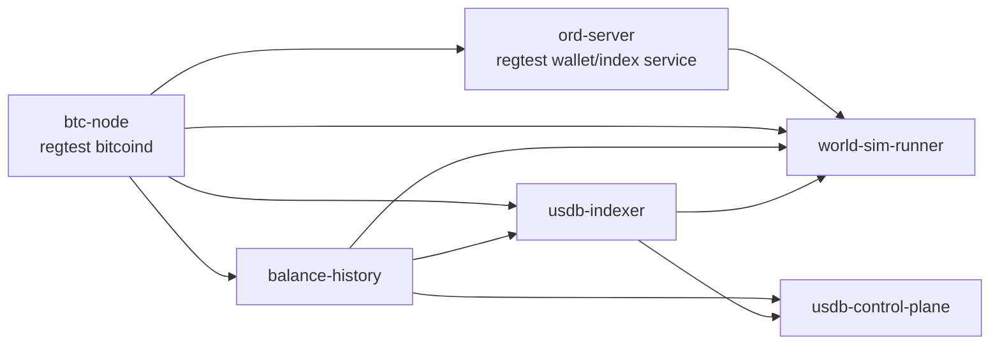

# Dev-Sim World-Sim Plan

## 1. Goal

This document defines how to integrate the existing regtest `world-sim`
infrastructure into the Docker-based `dev-sim` environment without changing the
default local development path.

The target is:

- keep `dev-sim` as the default baseline stack
- add `world-sim` as an optional overlay
- reuse the existing agent simulation model instead of re-implementing it
- make the local control console show a network that is actively producing BTC
  blocks and protocol activity

## 2. Design Principles

### 2.1 Keep default `dev-sim` unchanged

The current `dev-sim` remains the standard local stack:

- `bitcoind` in `regtest`
- `balance-history`
- `usdb-indexer`
- `ethw-node`
- `usdb-control-plane`

This stack should still be usable without background protocol traffic.

### 2.2 Add `world-sim` as an overlay

The simulation layer should be introduced through:

- `docker/compose.world-sim.yml`

This overlay adds extra services, but does not alter the meaning of the base
`dev-sim` stack.

### 2.3 Reuse the existing simulation logic

The canonical protocol simulation logic already exists in:

- [regtest_world_simulator.py](/home/bucky/work/usdb/src/btc/usdb-indexer/scripts/regtest_world_simulator.py)
- [regtest_world_sim.sh](/home/bucky/work/usdb/src/btc/usdb-indexer/scripts/regtest_world_sim.sh)
- [run_live.sh](/home/bucky/work/usdb/src/btc/usdb-indexer/scripts/run_live.sh)

The Docker integration should reuse these semantics and defaults instead of
creating a second simulation model.

## 3. First-Batch Scope

The first implementation batch should add:

1. an `ord-server` service for regtest wallet and inscription operations
2. a `world-sim-runner` service that:
   - waits for `btc-node`, `ord-server`, `balance-history`, and `usdb-indexer`
   - prepares miner and agent wallets
   - performs the same premine / funding / confirmation flow as the existing
     standalone world-sim scripts
   - invokes `regtest_world_simulator.py`
3. a helper command for local operators

The first batch does **not** need to:

- replace the current standalone shell world-sim entrypoints
- make `world-sim` part of the default `dev-sim` boot path
- automatically wire ETHW user wallets
- add a production deployment path

## 4. Service Topology

## 5. Image and Binary Strategy

For the first batch, the world-sim overlay remains explicitly development-only.

Therefore it is acceptable to require host-provided dev binaries:

- `ord`
- Bitcoin Core 28.x binaries:
  - `bitcoind`
  - `bitcoin-cli`

The Docker services mount these binaries from the host filesystem.

In the first batch, the `world-sim` overlay also overrides `btc-node` so the
regtest node itself runs from the mounted Bitcoin Core 28.x toolchain. This is
required because `ord wallet` flows in the simulator depend on Bitcoin Core
28.0.0+ semantics.

Rationale:

- this avoids creating a new release pipeline for ord in the first batch
- the existing host-side world-sim scripts already rely on locally available
  binaries
- the overlay is optional and only used in local development / demo scenarios

This is not the final production packaging model.

## 6. Configuration Model

The world-sim overlay uses a dedicated env file, separate from the default
`dev-sim` env:

- `docker/env/world-sim.env.example`
- local copy:
  - `docker/local/world-sim/env/world-sim.env`

This keeps the default `dev-sim` path unchanged while still allowing a single
command to start the optional overlay.

Key additional inputs:

- host path to `ord`
- host path to Bitcoin Core binaries
- simulation parameters such as:
  - `SIM_BLOCKS`
  - `SIM_SEED`
  - `AGENT_COUNT`
  - `SIM_SLEEP_MS_BETWEEN_BLOCKS`

## 7. Operator Entry

The recommended local entry is a helper script:

- `docker/scripts/run_world_sim.sh`

This helper should:

- initialize `docker/local/world-sim/env/world-sim.env` from the example if
  missing
- keep `world-sim` separate from plain `dev-sim`
- provide a stable operator interface:
  - `up`
  - `up-full`
  - `ps`
  - `logs`
  - `down`

Recommended behavior:

- `up`
  - starts the BTC-side stack plus the world simulator
  - does not require `ethw-node`
- `up-full`
  - starts the same stack and keeps the normal `ethw-node` in the graph

## 8. Expected Console Outcome

Once the world-sim runner starts producing blocks and protocol actions, the
control console should move from mostly static readiness indicators to a live
system view:

- BTC height increasing
- `balance-history` and `usdb-indexer` synced heights increasing
- protocol-related data becoming queryable

This provides a much better local demo and later becomes a stronger base for:

- wallet integration
- miner-pass mint demos
- SourceDAO contract interaction demos

## 9. Future Extensions

After the first batch is stable, the next candidates are:

1. expose world-sim report artifacts in the console
2. add an `interactive sandbox` mode for manual user actions without random
   background traffic
3. optionally replace host-mounted binaries with a more self-contained dev image
4. later connect ETH / BTC wallet flows to the same local stack
