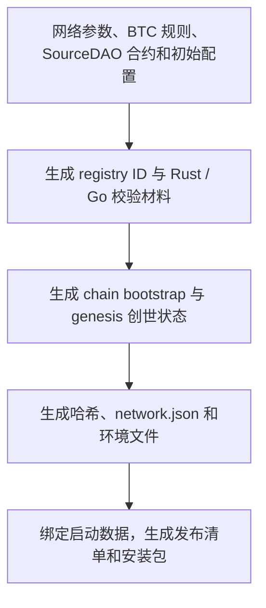

# 看懂网络配置与生成关系

[进阶建网入口](README.md) · [testnet-v1 网络资料](../networks/testnet-v1.md)

本页以仓库中的 [testnet-v1 网络包](../../../docker/networks/testnet-v1/README.md)为例。它是一组需要相互核对的完整文件，不是一份可以单独修改的配置。普通节点直接使用经过发布校验的包；下面的阅读命令不会修改配置或启动服务。

## 每类文件负责什么

所有路径相对 `docker/networks/testnet-v1/`：

| 文件 | 用途 | 修改时的关系 |
| --- | --- | --- |
| `network.json` | 网络总目录：身份、BTC 来源、规则选择、各制品路径和摘要 | 必须和 genesis、registry、环境及发布清单一致 |
| `artifacts/usdb-chain-bootstrap-config.json` | 建链输入：chain ID、BTC origin、USDB 激活点、难度、合约预部署和初始化管理员 | 修改后由生成器重建创世状态及相关摘要 |
| `artifacts/btc-activation-registry-catalog.json` | BTC 规则目录：来源、作用域、稳定滞后、按 BTC 高度启用的版本 | 从权威 registry 输入生成；Rust indexer 与 Go 链验证端须支持同一身份 |
| `artifacts/usdb-genesis.json`、`artifacts/usdb-genesis.manifest.json` | 完整创世状态及其来源、哈希记录 | 属于生成结果，不作为修改 chain ID 的唯一入口 |
| `artifacts/sourcedao-bootstrap-*.json`、`artifacts/sourcedao-contract-golden.json`、`artifacts/bootstrap-manifest.json` | DAO 初始配置、导入与冻结记录、合约代码校验材料 | 合约代码可复用；管理员、分配与委员会须按新网络明确选择并重新冻结 |
| `network.env`、`compose.network.yml` | 网络级运行参数和容器网络标识 | 与总目录保持一致；不是各节点任意覆盖共识的入口 |
| `node.env.example` | 本机配置模板：镜像、数据路径、资源、端口、角色及凭据空位 | 正式发布包会填入固定镜像等值；实际配置由节点工具管理，不公开凭据 |
| `bootnodes.json` | 默认 Seed 列表 | 接入资料可更新，不改变 genesis；地址必须真实属于目标网络 |
| `release-bootstrap.json`、`release-inputs/` | 发布时选用的 BTC 启动数据及签名材料 | 需绑定目标网络包，并按数据来源验证兼容性 |
| `trust/`、`snapshots/` | 快照信任公钥及快照发布记录 | 记录用于验证的公开材料，不放签名私钥；不能任意改摘要绕过验证 |

`network.json` 的制品摘要用于发现文件被更改或搭配错误；它们不是 genesis block hash。即使文件仍是合法 JSON，手动改一个字段也可能使整包无法通过验证。

## 从现有包读取参数

在已有 USDB 源码副本的根目录执行，需要 Python 3：

```bash
python3 -m json.tool docker/networks/testnet-v1/network.json
python3 -m json.tool docker/networks/testnet-v1/artifacts/usdb-chain-bootstrap-config.json
python3 -m json.tool docker/networks/testnet-v1/artifacts/btc-activation-registry-catalog.json
```

重点对照这些字段：

| 要理解的参数 | 查看位置 | testnet-v1 示例及解释 |
| --- | --- | --- |
| 钱包和交易的链身份 | `network.json.chain_id` 与 bootstrap `chainId` | `202610030`；两处和最终 genesis 必须一致 |
| P2P 网络选择 | `network.json.network_id` 与 `network.env` | 当前同为 `202610030`；相同端口不代表同网 |
| 网络包与规则作用域 | `network_bundle_id`、`btc_source.rules_scope` | 当前均为 `usdb-testnet-v1`；作用域用于隔离规则及其状态身份 |
| Bitcoin 链和索引起点 | `btc_source.network_id/index_origin_height` | `btc-mainnet`、`963800`；USDB 从 block 0 启动，不意味着 BTC 索引从 0 起算 |
| BTC 侧规则 | registry 的 `scope`、`records[].activation_height/version_value` | MinerPass schema/state 为 v2，能量等仍为 v1；这里的高度是 BTC 高度 |
| USDB 侧规则 | bootstrap 的 `usdbConsensus.activations[]` | `block: 0` 绑定目标 `btcActivationRegistryId`；这里的高度是 USDB 高度 |
| 稳定状态延迟 | registry 的 `scope.stable_lag_blocks` | `10`；不是每个节点可随意调整的同步性能参数 |
| 管理员和预部署 | bootstrap 的 `bootstrapAdmin`、`predeploys` 及 DAO 初始配置 | 新运营者必须改为自己安排的治理身份；复制官方地址不会获得其控制权 |

环境变量 `USDB_GENESIS_BLOCK_HEIGHT` 在当前包中值为 `963800`，表示 BTC 索引 origin；不要把这个历史命名理解成 USDB 创世块的高度。USDB 的 genesis 始终是该新链的 block 0。

## 为什么修改 ID 后还要重新生成

生成关系可按以下顺序理解：



具体生成器负责处理文件之间的依赖；不要按这个示意自行逐个填写摘要。testnet-v1 的权威规则输入在 [usdb-testnet-v1.json](../../../src/btc/usdb-util/activation-registry/usdb-testnet-v1.json)。生成器据此创建包内 catalog，并以 Go 生成器创建 genesis。chain ID 还参与 `0x1000` 系统账户的初始状态计算，只编辑 `genesis.config.chainId` 而保留旧 `alloc` 会留下错误状态。

SourceDAO 合约地址可以在不同链上相同，但代码、管理员、初始分配和运行状态是不同维度。官方 v1 明确选择了复用部分 v0 冻结输入；这不意味着你的独立网络应沿用官方管理员，也不意味着可以复制旧链正在运行的合约数据库。

## 哪些可以复用，哪些需要隔离

| 配置或数据 | 可以怎样复用 | 必须确认的边界 |
| --- | --- | --- |
| 程序、合约代码、默认资源策略 | 同版本和同规则下复用构建输入 | 程序确实支持新网络及其 registry；主网参数另行评审 |
| Bitcoin 数据或签名 UTXO 制品 | 同 BTC 来源且满足启动合同才可复用 | 哈希、签名、基线高度及历史取证可用；不能让两个进程并发写同一 Core 数据目录 |
| Balance History 数据 | 相同模式、origin/hash 和存储合同下评估复用 | 通过工具兼容性检查，不能只因都读 BTC 主网就复用 |
| indexer、USDB 链、控制台状态 | 新网络按自身身份生成独立数据路径 | 不复制旧作用域 checkpoint、运行期 DAO 状态或启动验收标记 |
| Seed 地址 | 可以复用已切换到目标网络的服务器端点 | 旧网 enode 列表不是新网已可接入的证明 |
| 私钥、RPC 密码及签名权限 | 独立管理，公开配置只保存必要地址或公钥 | 不能随模板或公开网络包分发秘密 |

每个发布网络保留一份完整、固定的配置快照，便于安装和复现。即使将来共享模板，也应在生成时展开成独立网络包，避免修改共享文件后悄悄改变已经发布的网络。本章不要求现在引入模板继承或运行时共享配置。

## 当前能执行的检查

对仓库中**未自行改造的、已受支持的网络包**，可运行静态一致性检查：

```bash
python3 docker/scripts/tools/validate_network_bundle.py \
  --bundle-dir docker/networks/testnet-v1
```

这不会启动节点，也不验证真实 P2P 入网或完整同步。确定性重建还需要 Rust、Go 和锁定的 SourceDAO 制品，命令见[发布侧复现步骤](../../publish/usdb-testnet-v1-network-bundle.md#复现与检查)。

当前 `generate_testnet_v1_bundle.py` 专门重建 v1；`validate_network_bundle.py` 只认识已登记的 v0/v1 配置；Go 验证端也显式识别受支持的 registry。发布版本格式虽包含 testnet/mainnet，仍不等于已经有任意主网或多个平行主网的生成能力。新网络需要先补齐这些支持和对应测试，再交付安装包。普通节点使用者无需执行这一步，也不应禁用检查来安装自行拼接的包。
