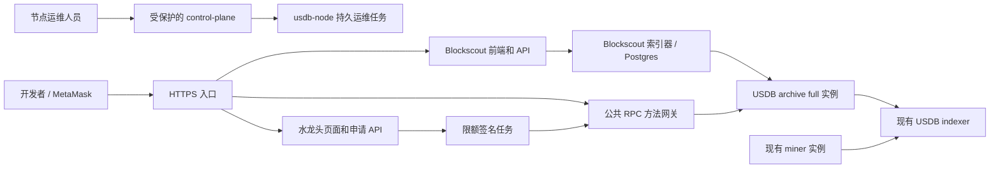

# USDB 公共测试网服务推进方案

状态：选型与只读接入检查已完成；浏览器部署、公共 RPC 网关和水龙头仍待实现及上线验收。
首版按复用现有测试机准备，实际域名由运维人员后续提供。顺序为：浏览器与公共 RPC → 水龙头 → 节点控制中心。

## 1. 三类入口

| 入口 | 使用者 | 首版职责 |
| --- | --- | --- |
| 区块浏览器与公共 RPC | 外部开发者、钱包用户 | 查询区块／交易／地址／合约、添加钱包网络、发送用户自己签名的交易 |
| 水龙头 | 测试应用开发者 | 领取少量 USDB 原生测试代币支付 gas，查询申请和交易进度 |
| 节点控制中心 | full／miner 节点所有者 | 查看本节点服务、同步、挖矿和恢复状态，执行经过授权的本地运维操作 |

域名作为公开服务配置管理，分别设置 explorer、rpc、faucet URL；不写入共识 genesis，也不修改当前
network bundle 身份。这里的“测试网”指 USDB 测试网络；其 BTC 数据源仍是 Bitcoin mainnet。
水龙头只转出 USDB 测试代币，不提供 BTC，也不直接铸造 BTC 矿工证。

## 2. 浏览器选型与已有代码

推荐 **Blockscout**：有 Geth 接入、独立索引数据库、地址／交易／合约查询和合约验证能力，
支持自行托管。官方提供 [Docker Compose 部署入口](https://docs.blockscout.com/setup/deployment/docker-compose-deployment)。
先适配和部署上游，不维护自写的通用 EVM 浏览器。

本轮检查的候选上游版本为 [backend v11.2.7](https://github.com/blockscout/blockscout/releases/tag/v11.2.7)
和 [frontend v2.10.3](https://github.com/blockscout/frontend/releases/tag/v2.10.3)。这些是待验收候选，
尚未运行组合兼容性测试，也未冻结镜像 digest；不能据此直接发布。正式部署记录要固定 backend、
frontend、Postgres、反向代理及启用的微服务版本和 digest，保留上游许可及品牌要求。

[Otterscan](https://github.com/otterscan/otterscan) 更依赖 Erigon 及其专用接口。
当前 USDB 是 Geth fork，不能用普通 Erigon 替换其共识实现，因此不作为本轮首选。

现有工程包含以下可复用部分，但它们承担的职责不同：

- `src/btc/usdb-control-plane` 和 `web/usdb-console-app`：节点控制台及服务聚合，已有 EIP-1193 钱包连接代码。
- `web/usdb-indexer-browser`：BTC 矿工证／能量等 indexer 数据查询。
- `web/balance-history-browser`：BTC 余额历史查询。
- `docker/scripts/tools/usdb_node.py`：持久运维任务、互斥和恢复的现有入口。

control-plane 还包含 world-sim 身份、开发签名材料和 mint 执行路由；其运行模式门禁和现有本地端口
边界不能替代面向公网的认证授权。其节点管理入口继续通过受控运维通道访问，不挂到公开浏览器域名。

## 3. 已验证的测试机事实

本轮通过 SSH 和 loopback RPC 只读检查，未重启服务、调整配置或发送交易。
完整接入报告的观察时间为 `2026-09-08T06:09:20.509417+00:00`（远端 UTC）：

| 项目 | 结果 |
| --- | --- |
| 网络 | `usdb-testnet-v0`，chain ID `202608250` / `0xc138e7a` |
| Genesis | `0x12a1baed070d1521d791b73956a8b5cf1613fc9504636f215390c1f839992a23`，与 release bundle 一致 |
| 观察区块 | 3485，`0x8b59c9dbfcc01985658e2b2bf8ca353a560637766c45ccc870b95535547f822a` |
| EVM 基础样本 | 区块、余额、nonce、code、call、estimateGas、gasPrice、feeHistory、日志等检查通过 |
| 交易样本 | 区块 35 的 `0xccb808b8fe97c692ed60f41dd4d69b960d803fccd02ad1f03ddde56661a83af0`，交易、回执和所在区块对应 |
| 历史余额 | head−256 的采样失败，RPC 错误码 `-32000`；不能宣称完整历史状态可用 |
| 当前 HTTP namespace | `admin, eth, miner, net, rpc, txpool, web3`；无 `debug` |
| `extraData` | 样本为 111 字节；本链允许 USDB selector payload，不能按 Ethereum 32 字节限制裁剪 |
| 资源 | 8 vCPU、约 62.7 GiB RAM；服务实际占用低于各自内存上限 |

基础 RPC 样本通过不代表 Blockscout 已适配，也不代表 MetaMask 发交易、合约部署或公共访问控制已验收。
本轮共执行 20 项采样，其中历史余额为非必需项且失败；未执行 tracing、交易广播或浏览器端钱包操作。

## 4. 同机部署与资源分配

公共服务使用独立 Compose project、独立数据目录和独立配置，更新它不触发节点 `down/up`。
建议结构如下，图中的 archive chain 为完整浏览器阶段需要验收的新实例：



现有资源策略并非按当下 RSS 分配：steady 的服务及短期任务上限合计约为机器内存的 `53/64`，
另留 `10/64` 给系统，总计 `63/64`。因此不能直接把“目前 MemAvailable 很大”当成公共服务的
永久预算。启动公共 stack 前，资源规划器需要显式扣除公共服务预算，保留系统最低余量，
并同时检查 bitcoin／overlap／steady 三阶段；上限和实际机器内存仍分开记录。

同机首轮可按 **8 GiB 公共服务总预算**做压测起点，覆盖浏览器、Postgres、网关和小型 archive
实例。这是拟议预算，不是已验证的最低配置；应按索引、历史 tracing 和并发查询测试调整。
32 GiB 节点不自动继承这套同机配置。限流和低索引并发优先保证原 miner、BTC 和 BH 服务运行。

容器通过显式的私有网络访问选定 RPC，数据库不发布公网端口。若接入当前 node Docker network，
使用其实际网络名与 `usdb-chain:8545`，不通过把宿主机 `8545` 改成 `0.0.0.0` 来解决连通性。
公开 HTTPS 的 `443`（以及确有需要的 `80`）作为新的入口单独纳入防火墙；原 operator RPC 继续
保持 loopback，遵循现有 [端口基线](usdb-node-firewall-operations.md)。

## 5. 第一阶段：浏览器与钱包 RPC

### 5.1 两步验收

先做同机私有预览：验证 Blockscout 正确索引真实 USDB 区块、SourceDAO 部署交易、receipt/log、
地址余额和合约代码。使用外部代理提供的浏览器端地址，避免把容器 DNS 写进浏览器配置。
不启用历史 tracing 时，需要明确关闭对应抓取功能并显示能力缺口，不能把缺失数据展示成零。

完整的公共浏览器需要专用 archive/tracing 能力。[Blockscout 的 RPC 要求](https://docs.blockscout.com/setup/requirements/node-tracing-json-rpc-requirements)
包括历史状态查询，Geth 内部交易使用 `debug_traceTransaction` 或 `debug_traceBlockByNumber`。
建议新增独立 USDB chain 数据目录的 archive full 实例，从创世块重放当前 USDB 链，并复用现有
BTC-side indexer 服务。它不是新的 Bitcoin/BH 全量同步，也不能与 miner 共享可写 chaindata。
该实例仍需通过原共识和重组门禁；这条部署路径尚待实现及验证。

给现有已裁剪节点加 archive 参数不能补回所有已经丢弃的历史状态。历史调用与 tracing 的恢复
需要独立验证，不能以“当前余额可读”代替。首次预览可以关闭内部交易抓取和历史余额功能，
完整上线前则要明确补齐哪些历史功能。[相关配置](https://docs.blockscout.com/setup/env-variables/backend-env-variables)
包括 `INDEXER_DISABLE_INTERNAL_TRANSACTIONS_FETCHER`、`ETHEREUM_JSONRPC_DISABLE_ARCHIVE_BALANCES`、
`INDEXER_DISABLE_BLOCK_REWARD_FETCHER`；这些开关不会自动完成 USDB 特有语义适配。

### 5.2 USDB 语义适配

- `extraData` 原样索引和展示；后续增加 selector/BTC anchor 解码，不能截断或伪装成 Clique POA 数据。
- 新发行量、累计 issued、miner/Dividend 奖励和手续费分账以 UIP-0011～0013 为准。
  尚未完成适配时隐藏相应统计及 API，不能采用 Ethereum 固定块奖励或旧 burn 假设。
- 测试币符号使用 `USDB`，精度 18，网络名称明显标注 Testnet；禁用未经核对的外部价格、市值和供应量推算。
- SourceDAO 预部署合约及代理的代码验证使用本次冻结 artifact、编译设置和真实部署交易。
  提交合约验证、UUPS 代理识别、ABI 读取都需要实际验收，不能只看合约地址页面能打开。
- 区块、交易和地址链接保留完整哈希；重组时旧分支不得继续显示为主链。

### 5.3 公共 RPC

公共钱包 RPC 与 Blockscout 的查询 API 分别提供，前者明确支持标准 EVM 请求及
`eth_sendRawTransaction`。浏览器 API 不能直接视为完整的钱包 RPC。

网关解析 JSON-RPC，按方法逐项允许；批量请求中的每一项也必须通过检查。允许受限的区块、
交易、余额、code、nonce、call、estimateGas、feeHistory、logs 和原始签名交易广播。
禁止 `admin_*`、`miner_*`、`personal_*`、`debug_*`、`txpool_*`、`engine_*`、`eth_sendTransaction`
及节点签名接口。只按 namespace 放行整个 `eth` 仍不够；不能用 Nginx 字符串正则替代 JSON 解析。

限制请求体、batch 数量、并发、每 IP 频率、`eth_getLogs` 区块范围及执行超时。
WS 可在首版之后单独验收，HTTP 钱包接入先完成。跨域允许策略、HTTPS、错误响应和限流行为
都要从机器外部验证；CORS 不是认证或限流措施。

钱包配置从已验证的 network bundle 和公共 URL 配置生成，采用
[MetaMask 网络添加／切换接口](https://docs.metamask.io/metamask-connect/evm/guides/manage-networks/)：
chain ID `0xc138e7a`、名称 `USDB Testnet`、原生代币 `USDB` / 18 位、公共 HTTPS RPC 与浏览器 URL。
不把第三方 Chainlist 收录作为可用前提，也不在域名未确定时提交占位地址作为正式钱包配置。

### 5.4 上线验收清单

1. 按当前 network/genesis 完成基础 RPC 检查及 Blockscout 实际索引追平，保留镜像 digest 和报告。
2. 从外部网络通过 MetaMask 添加／切换网络，查询余额；使用测试签名账户完成一笔转账和一笔合约调用。
3. 浏览器能展示这些交易、回执、日志、地址余额及 SourceDAO 代理／实现关系；与节点 RPC 对照。
4. 通过隔离 fixture 测试禁止方法、混合 batch、异常 JSON、超限日志查询；不向真实 miner 发送危险方法来测试拒绝。
5. 验证历史功能范围、USDB 奖励与供应量显示、重组处理，以及公共压力下的节点资源上限。
6. 域名、TLS 和对外端口确认后再开放访问，保存可回滚的部署配置。浏览器故障不触发共识节点重置。

## 6. 第二阶段：水龙头

推荐独立小服务，浏览器导航接入“领取测试币”。Blockscout 支持配置
[Get gas 外链入口](https://docs.blockscout.com/setup/env-variables/frontend-common-envs/envs#get-gas-button)，
因此视觉上可以统一，签名和领取队列独立部署。

水龙头使用专用低余额账户转账，不改 USDB 发币规则，不复用 miner、SourceDAO bootstrap admin
或委员会私钥。余额由运维人员明确转入；金额和每日总额按测试用途、gas 和实际资金确定。
额度可以覆盖若干笔测试操作，不预设每次发放大量原生币。

实现地址／IP 冷却、每日总预算、余额不足暂停、验证码或邀请机制、请求幂等与状态查询。
签名前持久化申请、nonce 和待广播交易；重试原交易而非重新分配 nonce。处理同一地址并发请求、
RPC 超时、nonce 替换及回执重组。密钥通过私有文件或独立签名器注入，不进入网页、日志或公开配置。
验收应能证明重复提交只发一次、未知链身份拒绝签名，且任务恢复后不会重复出款。

## 7. 第三阶段：节点控制中心

继续使用现有 control-plane/React console。先整理 full／miner 的真实状态模型：已配置角色、
实际挖矿、近期出块、上游稳定高度、有效矿工证／能量、资源计划、SourceDAO 阶段和失败恢复入口。
同时更新 snapshot、registry 和 SourceDAO 旧 marker 路径，使用当前 release 的正式状态接口。

先验收只读视图和认证入口，再设计写操作。写操作调用同一套 `usdb-node` 持久任务与互斥门禁，
不在网页后端另写一套 Docker 控制或直接修改 `node.env`。矿工地址、首节点声明、角色变更都要
有明确操作人、确认与审计记录。部署私钥不能经由网页请求上传到 control-plane。

## 8. 本轮交付与下一个实施点

已增加只读工具 `docker/scripts/tools/check_explorer_rpc.py`，随 node-kit 打包。例如在源码中执行：

```bash
python3 docker/scripts/tools/check_explorer_rpc.py \
  --bundle-dir docker/networks/testnet-v0 \
  --rpc-url http://127.0.0.1:8545 \
  --transaction <已上链的交易哈希> > explorer-rpc-report.json
```

该工具验证 bundle 身份，固定观察区块，采样标准 RPC、可选历史余额和交易回执，结束前复查
区块哈希。默认不做 tracing、不签名、不广播、不改节点配置；`--trace` 需显式提供交易且只用于
私有 tracing 入口。报告不记录 RPC URL，不包含私钥或原始签名交易；依然应区分诊断报告和上线验收。
返回 0 只表示所选必需样本通过，非必需失败和未测试项仍保留在报告中。

下一实施批次先补公共服务资源预留与同机 archive 接入，再固定 Blockscout Compose 及公共 RPC
网关，完成私有预览验收；域名到位后进行外部钱包验收和 HTTPS 上线，之后进入水龙头。
