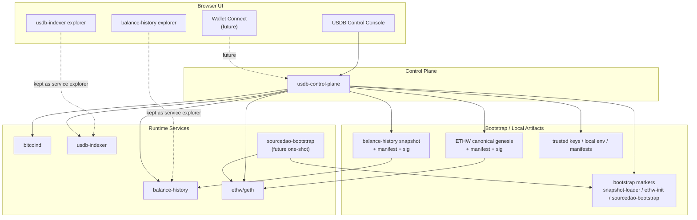

# USDB Control Console Plan

## 1. 目标

这份文档用于定义一个统一的本地控制台（`USDB Control Console`）设计。

它的目标不是替代现有的服务级浏览页面，而是在它们之上增加一层：

- 面向整套系统的状态总览
- 面向本地运维/管理员的冷启动与运行观测
- 面向后续钱包接入和链上操作的统一入口

控制台的第一阶段重点应是：

- **看清整个系统**
- **统一查看各服务状态**
- **统一查看 cold-start / bootstrap 进度**

而不是一开始就把所有写操作、钱包交互、业务操作都塞进去。

## 2. 当前现状

当前仓库内已经存在两个独立的服务级前端：

- `web/balance-history-browser`
- `web/usdb-indexer-browser`

它们的特点是：

- 都是轻量静态页面
- 浏览器直接访问各自 JSON-RPC
- 各自只关注单个服务

这种结构适合：

- explorer
- demo
- 调试单个服务

但不适合继续直接演进成“整套系统的控制台”，因为后续会遇到几个问题：

- 需要跨服务聚合状态
- 需要读取 Docker / marker / bootstrap 文件状态
- 需要在同一界面里统一表达 `bitcoind / balance-history / usdb-indexer / ethw / sourcedao-bootstrap`
- 后续钱包与管理员操作不适合直接靠浏览器连多个后端 RPC

## 3. 设计原则

推荐按照下面几条原则推进：

1. 保留现有两个 browser 页面，作为 service explorer
2. 新增一个统一控制台，不直接把两个页面拼接成 tab
3. 在控制台和底层服务之间增加一层轻量聚合后端
4. 第一阶段优先只读观测，第二阶段再接钱包与写操作
5. 运维/管理员视角与普通用户视角明确分层，不要一开始混成一个页面
6. 默认面向全球用户时，UI 与 API 文案以英文为主，双语能力由前端 i18n 提供
7. `buckyos_webdesktop` 作为上游参考，但 `usdb` 应保留本地冻结过的最小 WebUI 基线资源

### 3.1 UI 文案与双语策略

建议把国际化边界明确成下面两条：

- `control-plane` 返回稳定的英文状态值和结构化字段，不直接承担本地化展示职责
- `web/usdb-console` 负责语言切换和文本翻译，默认 `en`，后续按需启用 `zh-CN`

这样可以避免：

- 后端接口和某一种语言强耦合
- 前端只能被动展示后端拼接好的自然语言
- 后续增加更多语言时需要反复改 API

### 3.2 Upstream UI Adaptation Boundary

The console should follow the `buckyos_webdesktop` WebUI conventions, but it
should not directly depend on the full upstream project at runtime.

Instead:

- upstream remains the design and implementation reference
- `usdb` keeps a local adaptation guide in `doc/usdb-console-webui-adaptation.md`
- `usdb` stores a small frozen baseline under `web/shared/buckyos-webui-baseline/`

This keeps the control console aligned with the BuckyOS design language without
turning the `usdb` frontend into a hard downstream build of the full desktop app.

## 4. 总体架构

建议新增一个轻量 control-plane 服务，例如：

- `usdb-control-plane`

它负责：

- 聚合底层服务 RPC
- 读取本地 marker / bootstrap 文件
- 统一整理 readiness / provenance / bootstrap 状态
- 向前端提供单一 API

前端控制台只连这个 control-plane，而不是同时直连所有服务。

### 4.1 整体架构图

### 4.2 分层说明

推荐把系统分成三层：

#### Layer 1: Data Plane

底层实际运行的服务：

- `bitcoind`
- `balance-history`
- `usdb-indexer`
- `ethw/geth`
- 后续 `sourcedao-bootstrap`

#### Layer 2: Control Plane

新增聚合层：

- `usdb-control-plane`

职责：

- 聚合 RPC
- 聚合 readiness
- 聚合 snapshot / genesis / bootstrap provenance
- 统一对前端暴露 API

#### Layer 3: Console UI

统一控制台前端：

- `web/usdb-console`

职责：

- 展示系统概览
- 展示 cold-start / bootstrap 状态
- 提供到各模块 explorer 的统一入口
- 后续接钱包和管理员操作

Current runtime workspace:

- `web/usdb-console-app`

`usdb-control-plane` now serves the built `dist/` output from this React/Vite
app as the runtime control-console entry.

Detailed page-level information architecture and routing conventions are
captured in:

- `doc/usdb-console-information-architecture.md`

## 5. 为什么需要 Control Plane

不建议让浏览器直接访问：

- `bitcoind`
- `balance-history`
- `usdb-indexer`
- `ethw`
- Docker socket
- 本地 marker 文件

原因：

1. 浏览器无法自然读取 Docker volume / marker / 本地文件
2. 多个服务的 RPC 协议和返回结构不同
3. 后续涉及管理员操作和钱包交互时，权限边界会混乱
4. 后面如果服务增多，前端会越来越像“多个 explorer 的堆叠”

因此更合理的方式是：

- 把“系统视角”聚合到 `usdb-control-plane`
- 前端只对接一个统一 API

## 6. 建议的控制台信息架构

建议第一版控制台采用下面 4 个一级区域。

### 6.1 System

系统总览页，重点回答：

- 整套服务是否正常启动
- 哪些服务已 ready
- 哪些服务仍在 bootstrap / catch-up
- 当前网络、端口、版本、数据目录是什么

建议显示：

- `btc-node` 状态
- `balance-history` readiness
- `usdb-indexer` readiness
- `ethw-node` 状态
- Docker stack / compose project 状态
- 关键 marker 状态

### 6.2 Bootstrap

冷启动与初始化页，重点回答：

- 当前节点是否已经完成 bootstrap
- ETHW genesis artifact 是否匹配
- snapshot-loader 是否完成
- ethw-init 是否完成
- 后续 sourcedao-bootstrap 是否完成

建议显示：

- `bootstrap-manifest.json`
- `snapshot-loader.done.json`
- `ethw-init.done.json`
- 后续 `sourcedao-bootstrap.done.json`
- manifest / signature / trusted key 状态摘要

### 6.3 Protocol

协议只读观测页，重点复用当前 explorer 能力：

- balance-history 查询
- usdb-indexer 查询
- pass / energy / leaderboard

第一阶段建议：

- 先做 overview 入口
- 并保留跳转到现有两个 explorer 的链接

后续再逐步把核心查询能力收进统一控制台。

### 6.4 Wallet & Actions

第二阶段再引入的钱包与操作区：

- MetaMask / ETH wallet
- BTC wallet
- 矿工证 mint
- ETH 合约交互
- SourceDAO 操作

这部分不建议在第一阶段和运维状态页完全混合。

## 7. 第一阶段范围

第一阶段建议只做 **read-only overview console**。

### 7.1 第一阶段建议功能

- 系统状态总览
- 各服务 readiness 聚合
- bootstrap / marker / manifest 状态查看
- ETHW genesis / snapshot provenance 摘要
- 跳转到现有两个 explorer

### 7.2 第一阶段暂不做

- MetaMask 集成
- BTC wallet 集成
- 矿工证 mint
- SourceDAO 合约写操作
- 复杂管理员控制操作

## 8. 第二阶段范围

第二阶段可以继续扩：

- `sourcedao-bootstrap` 状态页
- MetaMask 接入
- BTC 钱包接入
- 统一的矿工证 mint / 资产操作入口
- 合约管理与 SourceDAO 运营入口

## 9. 建议的 API 边界

`usdb-control-plane` 第一版建议只提供聚合型 API，不重新发明底层协议。

例如：

- `GET /api/system/overview`
- `GET /api/system/services`
- `GET /api/system/bootstrap`
- `GET /api/system/artifacts`
- `GET /api/system/ethw`
- `GET /api/protocol/summary`

需要时再按需增加透传/聚合接口，例如：

- `GET /api/protocol/pass/:id`
- `GET /api/protocol/energy/:id`

原则是：

- 先做状态聚合
- 再做协议只读聚合
- 最后再做写操作代理

## 10. 与现有页面的关系

建议不要立即删除：

- `web/balance-history-browser`
- `web/usdb-indexer-browser`

更合理的过渡方案是：

1. 它们继续保留为独立 service explorer
2. 新控制台先提供统一 overview
3. 控制台中增加“进入服务 explorer”入口
4. 后续逐步把最常用的查询能力收编到控制台

这样可以避免：

- 一次性大改前端
- 丢失现有调试入口
- 控制台第一版职责过重

## 11. 推荐实施顺序

### Phase 1

- 新增 `doc/usdb-control-console-plan.md`
- 新增 `web/usdb-console`
- 新增 `usdb-control-plane` 最小聚合后端
- 打通系统状态 overview

### Phase 2

- 接入 bootstrap / marker / artifact 状态
- 把 Docker cold-start 状态整合到控制台

### Phase 3

- 并入 `balance-history` / `usdb-indexer` 常用只读查询
- 保留旧 explorer 作为调试页

### Phase 4

- 接入 MetaMask / BTC wallet
- 接入矿工证 mint 和 ETH 合约操作
- 接入 SourceDAO 运营管理动作

## 12. 结论

从整体架构角度，推荐路线是：

- 保留现有两个服务级 explorer
- 新增统一本地控制台
- 在控制台和底层服务之间增加一层 `usdb-control-plane`
- 第一阶段先做系统总览与 bootstrap 观测
- 第二阶段再逐步接钱包与链上操作

这样既不会打乱现有调试能力，也能为后续：

- Docker 运维
- 冷启动可视化
- 钱包接入
- SourceDAO 管理

留下清晰、可扩展的架构边界。
