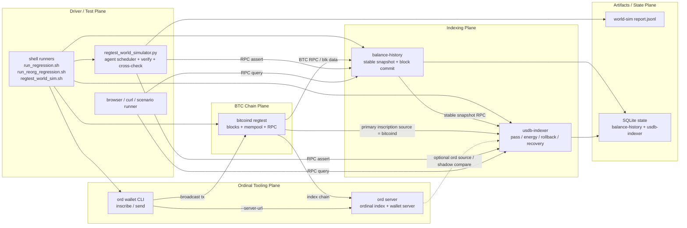
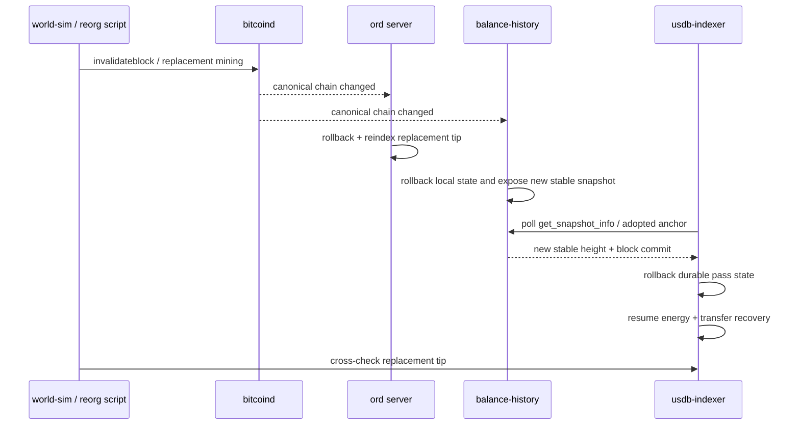

# USDB-Indexer Regtest 侧视拓扑架构

本文档从“测视拓扑”的角度说明 `usdb-indexer` 当前 regtest / world-sim 测试栈里各组件的职责、连接关系和 reorg 时的数据流。它的目标不是替代具体场景文档，而是回答两个更基础的问题：

1. 每个进程到底在链路里扮演什么角色。
2. world-sim / reorg 回归时，交易写入、索引同步和查询断言分别经过哪几层。

## 1. 总览图



## 2. 组件职责

### 2.1 `bitcoind`

- regtest 的唯一链状态源。
- 提供区块、mempool、wallet、`invalidateblock` / `reconsiderblock` 等底层能力。
- `balance-history` 和 `usdb-indexer` 的 BTC 数据最终都要回到这里校验。

### 2.2 `ord server`

- 为 `ord wallet` 提供可查询的 ordinals 索引视图。
- 在 live ord / world-sim 里，`mint`、`transfer`、`remint(prev)` 的交易构造依赖它。
- 它不是 BTC 共识源，而是建立在 `bitcoind` 之上的 ordinal 索引层。

### 2.3 `ord wallet CLI`

- 测试里的“交易注入器”。
- 负责把铭文相关业务动作翻译成真实 BTC 交易并广播。
- 在 world-sim 里，agent 的 `mint` / `transfer` / `remint` 大多是经由这一层落链。

### 2.4 `balance-history`

- 直接消费 `bitcoind`，维护稳定高度、余额历史和 block commit。
- 对 `usdb-indexer` 来说，它是“上游稳定快照提供者”。
- reorg 发生后，它先完成自己的 rollback / replay，然后把新的 stable snapshot 暴露给下游。

### 2.5 `usdb-indexer`

- 以 `balance-history` 暴露的 stable snapshot 作为同步 ceiling。
- 维护 `miner_pass_state_history`、`miner_passes`、`pass_block_commits`、active balance snapshot、energy 等本地状态。
- reorg 时根据 adopted upstream anchor 漂移执行 rollback，并通过 pending recovery 把 `energy` 和内存 `transfer tracker` 重新对齐。

### 2.6 `regtest_world_simulator.py`

- 不是链数据源，而是长时间组合回归的“编排与验收器”。
- 它负责驱动 agent 行为、等待同步、做 RPC 断言、做 global cross-check，并在启用时注入 deterministic reorg。
- reorg 后它还会重建本地 ownership 视图，避免后续动作继续沿用旧链缓存。

## 3. 三条关键链路

### 3.1 交易写入链路

```text
runner / simulator
  -> ord wallet CLI
  -> ord server
  -> bitcoind mempool + block
```

这里的关键点是：`ord` 在这条链路里不只是一个离线命令，而是 wallet 动作所依赖的在线索引服务。

### 3.2 索引同步链路

```text
bitcoind
  -> balance-history
  -> usdb-indexer
```

这是最核心的稳定状态传播路径。`usdb-indexer` 不直接以 BTC tip 作为对外承诺，而是以 `balance-history` 的 stable snapshot 作为同步边界。

### 3.3 查询与验收链路

```text
world-sim / browser / scenario runner
  -> balance-history RPC
  -> usdb-indexer RPC
  -> JSONL report / SQLite asserts
```

这一层负责回答“现在系统看起来是否一致”。它不改变链状态，只消费链状态和索引状态。

## 4. 当前 world-sim 中 `ord` 的真实角色

这个点最容易被误解，单独说明：

1. 在当前 `regtest_world_sim.sh` 默认配置里，`usdb-indexer` 的 `inscription_source` 是 `bitcoind`，所以 pass 识别的主读取路径来自 BTC RPC，而不是 `ord`.
2. 但 world-sim 里的业务交易注入仍然依赖 `ord wallet --server-url <ord server>`，所以 `ord server` 在写入链路里是必需的。
3. 如果未来把 `inscription_source` 切到 `ord`，或开启 shadow compare，那么 `ord server` 也会进入 `usdb-indexer` 的主读取/比对路径。

所以更准确的说法是：

- 在当前 world-sim 预设下，`ord server` 是“业务交易构造依赖”。
- 在某些配置下，它也可以升级成 `usdb-indexer` 的“业务读取依赖”。

## 5. Reorg 时的侧视变化



对回归脚本来说，reorg 场景的核心不是“块哈希变了”这么简单，而是下面这组不变量是否继续成立：

1. `ord`、`balance-history`、`usdb-indexer` 最终都收敛到 replacement tip。
2. `balance-history` 的 stable hash / commit 和 `usdb-indexer` adopted anchor 一致。
3. future `pass_block_commits`、future active snapshots、pending recovery marker 被正确清理。
4. reorg 后继续跑新业务时，world-sim 的本地 agent 视图和新链保持一致。

## 6. 推荐阅读顺序

1. 测试框架入口：[usdb-indexer-regtest-framework.md](/home/bucky/work/usdb/doc/usdb-indexer-regtest-framework.md)
2. world-sim 说明：[usdb-indexer-regtest-world-sim.md](/home/bucky/work/usdb/doc/usdb-indexer-regtest-world-sim.md)
3. world-sim reorg 组合回归：[usdb-indexer-regtest-world-sim-reorg.md](/home/bucky/work/usdb/doc/usdb-indexer-regtest-world-sim-reorg.md)
4. 同步状态语义：[usdb-indexer-sync-status-model.md](/home/bucky/work/usdb/doc/usdb-indexer-sync-status-model.md)
